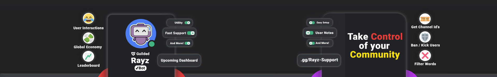

  

# Rayz

A warm welcome to the ***Rayz*** development team!  
Please read this document to understand how to contrbute to this project!

## > Preface

- Rayz is a multi utility guilded bot built in python upon [Shay's Guilded.py!](https://github.com/shayypy/guilded.py).   

- Please make sure you understand the API and how the wrapper works before continuing further!

- You are **NOT** allowed to commit to main. Please open a PR and wait for someone else from the Rayz Development Team to review your code and merge it into main.

- You are **NOT** allowed to share the source code of the bot.

## > How to use

- Please make sure you have a recent version of python 3 installed.

- Clone this repo.

- Make a test bot via Guilded on your own private server to test your changes on.

- Get its token.

- Paste it into config/config.json make the file if it's not there already.

- Run the bot
  - CD into project root dir.
  - Using a Virtual Environment for the project is recommended:
    - To create:
      -  On Windows: Execute `python -m venv env`
      -  On MacOS/Linux: Execute `python3 -m venv env`
    - Activate virtual environment of the project, specific to OS and shell environment
      - Using VSCode && Python extension might be helpful if you are new
      - On Windows
        - Execute `./env/Scripts/Activate.ps1` on windows if using PowerShell
        - CD into the same dir and run `activate.bat` if using CMD
      - On MacOS/Linux
        - Execute `./env/Scripts/activate`
  - Install project dependencies to the venv:
    - On Windows: `pip install -r requirements.txt`
    - On MacOS/Linux: `pip3 install -r requirements.txt`
  - Configure via config.json taking inspiration from example
  - Use `./run.bat` or `python base.py` to get started if on windows.
  - Use `python3 base.py` to get started if on mac/linux.

- Run wild, Happy coding fellow Rayz Dev! ***GODSPEED***

  

